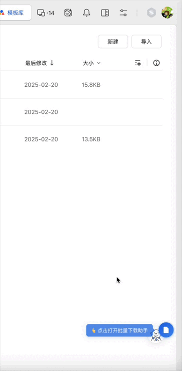
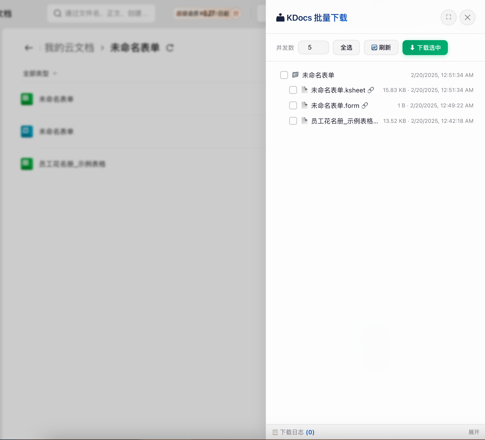
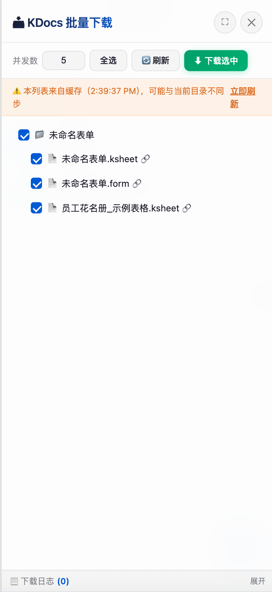
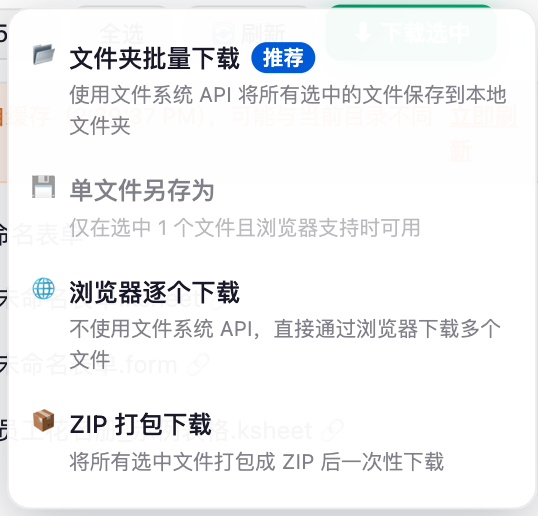
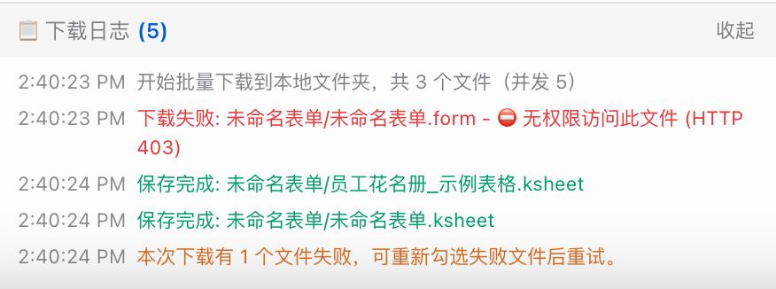

# [KDocs] 金山文档批量下载小助手

> 🚀 支持 PC / 移动端 / 企业版！拥有优雅的 UI 界面，提供批量下载、文件夹层级保留、ZIP 打包等多种下载方式。

  

## ✨ 核心功能

- **📱 全平台支持**：完美适配 PC 端、移动端（手机/平板）、企业版 KDocs、个人/团队空间。
- **📂 保持目录结构**：下载多层级文件夹时，自动在本地创建对应的文件夹结构（需支持的浏览器）。
- **⚡️ 多种下载模式**：
  - **单文件另存为**：像原生下载一样简单。
  - **批量保存**：并发下载多个文件，速度飞快。
  - **ZIP 打包**：自动打包为 ZIP 下载，解决浏览器拦截多文件下载问题。
  - **浏览器下载**：兼容性最好的传统下载方式。
- **🎨 优雅 UI**：
  - **悬浮球**：自动吸附边缘、闲置半隐藏、位置记忆、可拖拽。
  - **操作面板**：类原生设计风格，支持全屏切换、宽度调整、深色模式（计划中）。
  - **移动端适配**：手机上自动全屏面板，操作按钮加大，触控友好。
- **🛡️ 稳定可靠**：
  - **智能缓存**：5分钟本地缓存，避免频繁请求 API 导致限流，刷新页面秒开。
  - **防重复**：智能识别 SPA 路由切换，永远只显示一个助手。

## 📸 界面预览
 
| PC 端面板 | 移动端适配 |
|---|---|
|    |    |

| 下载方式选择 | 下载进度与日志 |
|---|---|
|    |     |

## 📖 使用指南

1. **进入文件夹**：在金山文档网页中进入你需要下载的文件夹（支持个人、团队、企业空间）。
2. **打开面板**：点击页面右下角的蓝色悬浮球 📄。
3. **勾选文件**：在面板中勾选需要下载的文件或文件夹（支持全选）。
4. **开始下载**：点击顶部的“下载”按钮，选择一种下载方式：
   - 💾 **保存到文件夹**（推荐）：选择一个本地目录，所有文件将按原结构保存进去。
   - 📦 **打包下载**：将选中的所有内容打包成一个 ZIP 文件。
   - 🌐 **浏览器下载**：逐个唤起浏览器的下载任务（文件多时需授权）。

## 🔧 常见问题

**Q: 为什么我有权限查看文件却下载失败？**  
A: 请确保你已登录金山文档账号。脚本复用你的登录凭证，如果你没有该文件的下载权限（如仅预览），脚本也无法下载。

**Q: 点击“悬浮球”没反应？**  
A: 请尝试刷新页面。如果安装了广告拦截插件，请检查是否误杀。

**Q: 手机浏览器如何使用？**  
A: 需要支持油猴脚本的浏览器，如 **X浏览器**、**Via浏览器**、**Kiwi Browser** (Android) 或 **Userscripts** (iOS Safari 扩展)。

## 📝 更新日志

### v1.0.0
- 🎉 首次发布，支持 PC/移动端/企业版。
- ✨ 引入 Web Component 架构，彻底解决重复渲染问题。
- 📱 优化移动端触摸体验，修复 iOS 下的点击穿透 bug。
- 🚀 支持 4 种下载策略，新增 ZIP 智能打包（自动去除公共根目录）。

---

*本项目仅供学习交流使用，请勿用于非法用途。*
